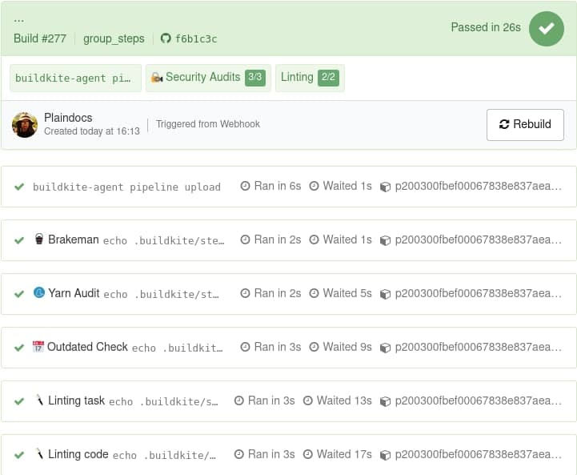

# Buildkite Group Step Example

This repository is an example [Buildkite](https://buildkite.com/) pipeline that [groups steps](https://buildkite.com/docs/pipelines/group-step) into two groups, Security Audits and Linting.

## Screenshot

## License

See [LICENSE](LICENSE) (MIT)
