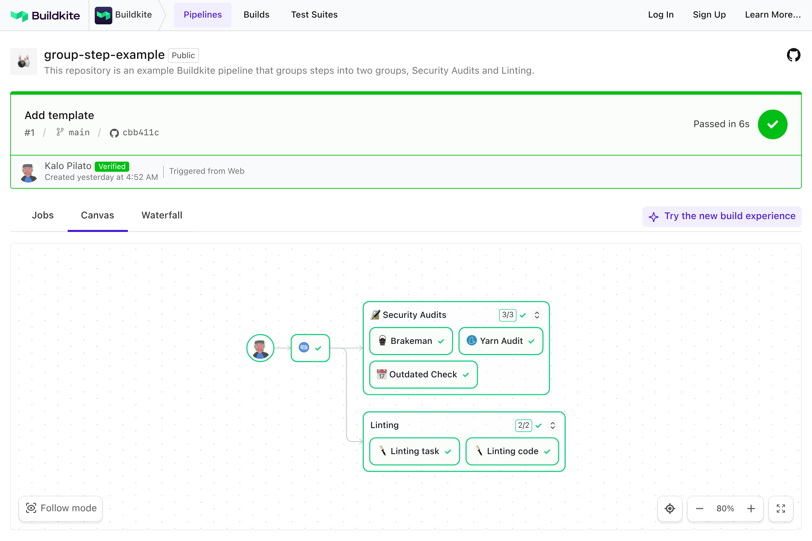

# Buildkite Group Step Example

This repository is an example [Buildkite](https://buildkite.com/) pipeline that [groups steps](https://buildkite.com/docs/pipelines/group-step) into two groups, Security Audits and Linting.

👉 **See this example in action:** [buildkite/group-step-example](https://buildkite.com/buildkite/group-step-example/builds/latest?branch=main)

See the full [Getting Started Guide](https://buildkite.com/docs/guides/getting-started) for step-by-step instructions on how to get this running, or try it yourself:

## License

See [LICENSE](LICENSE) (MIT)
